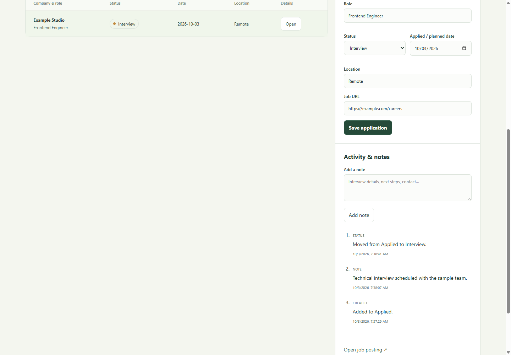

# ApplyLedger

A private, local job-application workspace built with Next.js, TypeScript, and
SQLite. Track applications, customize pipeline statuses, record notes and status
history, search/filter the workspace, and transfer data through JSON or CSV.

## Run

Requires Node.js 22.14+ and npm. SQLite uses a native better-sqlite3 binding;
platforms without matching prebuilt binaries need a native build toolchain.

```sh
npm ci
npm run dev
# Production:
npm run build
npm start
```

Open http://127.0.0.1:3000. Both scripts bind to loopback. The database is created
in `data/applyledger.sqlite`; set `APPLYLEDGER_DB_PATH` to change it. Keep SQLite
and its WAL together when copying a running database, or stop before copying.
JSON export provides an application-level backup.

## Workflow

Create an application with company, role, date, status, optional location, and
an HTTP(S) link. Select it to edit or add timeline notes. Status changes create
events automatically. Custom statuses support a name, color, and closed/open
classification. Built-in statuses and statuses containing applications cannot
be deleted.

JSON export preserves applications, status definitions, and complete events.
Import merges: existing application IDs are skipped, status names are matched
case-insensitively, and events attach only to newly imported applications.
Reimporting a backup does not duplicate its records.

CSV requires `company,role`; optional columns are `id,status,appliedAt,location,
url,latestNote`. Quoted multiline values and UTF-8 BOM are supported. Rows missing
company or role are skipped; bounded text is trimmed/truncated during import.
Invalid dates or URLs roll back the whole import. Missing dates use the current
UTC date. CSV captures the latest note as import history, not the full timeline.
Export escapes spreadsheet formula prefixes.

Imports are limited to 10 MiB; CSV permits up to 50,000 records and 200,000
characters per record. JSON is the full-fidelity backup format. Review records
after transfer. Synthetic sample data lives in `examples/applications.csv`.

## Trust model

This is a single-user tool without authentication. Keep the listener on loopback
on a trusted machine. APIs reject non-local Host values, foreign origins, and
cross-site browser requests. These controls do not protect against another local
user/process. Public hosting or shared accounts require an authentication design.
Data stays in SQLite; there is no cloud sync.

## Development

```sh
npm test
npm run lint
npm run build
```

Tests exercise SQLite transactions, event history, status protection, backups,
import rollback, CSV escaping, URL/date validation, and request boundaries.
`VERIFICATION.md` records acceptance evidence and limits. `ARCHITECTURE.md`
explains implementation decisions. Review `DEPENDENCY_REVIEW.md` before release.
MIT license.

## Preview

Synthetic example data from the local browser check.


